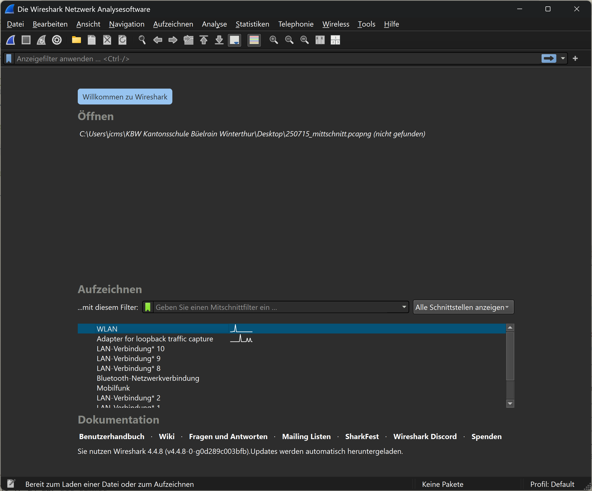
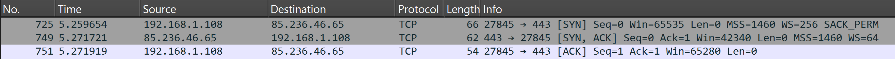

# Beobachten von Internetverbindungen

Die folgenden Ausführungen basieren auf der Analyse von Netzwerkpaketen,
welch mit Wireshark aufgezeichnet wurden. Dafür ist die Installation von
Wireshark erforderlich. Die 
<a href="https://www.wireshark.org/#download" target="_blank">
Website von Wireshark</a> stellt dazu den
entsprechenden Download zur Verfügung.

## Aufzeichnen von Netzwerkpaketen

Um Netzwerkpakete aufzuzeichnen, wird Wireshark gestartet. Das
Startfenster von Wireshark stellt sich folgendermassen dar:



Unter dem Titel "Aufzeichnen" kann der gewünschte Netzwerkadapter
ausgewählt und die Aufzeichnung gestartet werden. Die erfassten Pakete
werden in Echtzeit angezeigt und können später analysiert werden. In der
Schule wird die Verbindung zum Internet per WLAN hergestellt.
Entsprechend ist der WLAN-Adapter auszuwählen. Sobald der entsprechende
Adapter ausgewählt ist, kann die Aufzeichnung gestartet werden.
Gestartet wird die Aufzeichnung durch einen Klick auf das blaue
Haifischflossen-Symbol in der Symbolleiste. Die Auszeichnung startet
umgehend. Angehalten wird die Aufzeichnung mit einem Klick auf das
rote Quadrat-Symbol in der Symbolleiste. Die Aufzeichnung kann entweder
über das Menü Datei > Speichern, durch einen Klick auf das Dateisymbol
oder durch die Tastenkombination `Strg + S` gespeichert werden.

## Beobachten der DNS-Anfragen

### Filtern der Aufzeichnung

Um die DNS-Anfragen zu beobachten, wird bei laufender Wireshark
Aufzeichnung eine beliebige Website aufgerufen. Dadurch werden die
entsprechenden DNS-Anfragen erfasst und können in Wireshark
analysiert werden. Nach dem Aufruf der Website kann die Aufzeichnung
angehalten und die erfassten Pakete analysiert werden (wenn die
Aufzeichnung weiterläuft, bewegen sich die Pakete im Anzeigefenster
ständig weiter).

Damit die relevanten Datenpakete angezeigt werden, kann der
aufgezeichnete Datenverkehr gefiltert werden. Der Filter wird in der
Eingabefeld für "Anzeigefilter" eingegeben.


Der entsprechende Filter für DNS-Anfragen zu einer gegebenen Website
lautet 

```txt
dns.qry.name == "www.example.com"
```

Der angewendete Filterbefehl ist relativ einfach nachzuvollziehen.
An erster Stelle steht hier das Protokoll nach dem gefiltert wird. Weil
nach den DNS-Anfragen gefiltert wird, ist das hier `dns`. `dns` alleine
wäre bereits ein gültiger Filter. Allerdings werden dann alle DNS-Pakete
angezeigt. Der Filter wird daher zu `dns.qry.name` ergänzt Dabei steht
`qry` als Abkürzung für query - Anfrage. Die Ergänzung `name` steht für den Domain Name,
der Abgefragt wird. `==` ist die logische Verknüpfung, nach der gefiltert wird
und bedeutet hier "ist gleich". Zwischen den Anführungszeichen steht der
String, nach dem gesucht wird.  
Sofern die Seite während der Aufzeichnung genau
einmal aufgerufen wurde, wird der Filter zwei Pakete anzeigen: eine
DNS-Anfrage und eine DNS-Antwort.


Das Bild zeigt als erstes Paket die DNS-Anfrage für
www.deutschegrammaphon.com und als zweites Paket die entsprechende
Antwort.

### Analyse der gefilterten Pakete

Für eine genaue Analyse der Kommunikation kann ein einzelnes Paket
durch anklicken ausgewählt werden. Dadurch wird das Paket im unteren
Bereich von Wireshark detailliert angezeigt und kann genauer
untersucht werden.


Dass es sich hier im Bild um die Details des ausgewählten Paketes
handelt, ist an der übereinstimmenden Paketnummer zu erkennen. Die
Zeilen in der 
Detailansicht entsprechen den einzelnen Protokoll-Header-Feldern des
ausgewählten Paketes. Das bildet auch das TCP/IP Schichtenmodell ab.

Die Detailansicht kann durch einen Klick auf die Dreiecke am Anfang der
einzelnen Protokoll-Header-Felder erweitert werden. Dadurch werden
weitere Informationen zu den jeweiligen Feldern angezeigt. Hier werden
jedoch nur die Zusammenfassungen der Header-Felder erläutert.

Im Beispiel wird als erstes der Inhalt des Headers des Internetlayers erläutert. 

```text

Internet Protocol Version 4, Src: 192.168.1.108, Dst: 192.168.1.1

```

In der Zusammenfassung werden die die Quell- und
Ziel-Adressen des IP-Pakets angezeigt. Im vorliegenden Fall sind das jeweils die
Privaten IP-Adressen 192.168.1.108 und 192.168.1.1. 192.168.1.108
ist die Quell-Adresse, erkennbar an der Abkürzung "Src" und 192.168.1.1
die Ziel-Adresse, erkennbar an der Abkürzung "Dst". Beide Geräte
befinden sich damit im gleichen LAN. Der Rechner mit der IP-Adresse
192.168.1.1 ist der Router. Dieses Gerät stellt die Internetverbindung
her und kann DNS-Anfragen aus seinem Cache beantworten.

Im Header für das User Datagram Protocol (UDP) werden die Quell- und
Ziel-Ports angezeigt. 

```text
User Datagram Protocol, Src Port: 53586, Dst Port: 53
```
Der Quellport wurde mit 53586 automatisch und weit oberhalb der sog.
"Well-Known Ports" (0-1023) gewählt. Die "Well-Known Ports" sind Ports,
die von bestimmten Anwendungen oder Diensten standardmässig verwendet
werden. Entsprechend wurde der Zielport auf 53 gewählt, da dies der
standardmässige Port für DNS-Anfragen ist. Eine Liste der "Well-Known Ports"
findet sich in der 
<a
href="https://www.iana.org/assignments/service-names-port-numbers/service-names-port-numbers.xhtml"
target="_blank">
offiziellen IANA-Portdatenbank</a>. Der Quellport ermöglicht es dem
Zielsystem, die Antwort an den korrekten Absender zurückzusenden.
NAT-Geräte (vgl. 
[Abschnitt Network Address Translation (NAT)](../250822/nat.md))
nutzen diese Port-Informationen zusätzlich für die Zuordnung
zwischen privaten und öffentlichen Adressen. 

Der zuunterst dargestellte Layer in der Detailansicht, beinhaltet die
eigentliche Anfrage für die Übersetzung des Domainnamens in eine
IP-Adresse.

```text
Domain Name System (query)
    Transaction ID: 0x1f7a
    Flags: 0x0100 Standard query
    Questions: 1
    Answer RRs: 0
    Authority RRs: 0
    Additional RRs: 0
    Queries
        www.deutschegrammophon.com: type A, class IN
    [Response In: 723]
```

Aus diesem Grund wird dieser Teil der Analyse hier auch aufgefaltet
dargestellt.  
Unter dem Stichwort `Queries` wird die gesuchte Adresse
`www.deutschegrammophon.com` angezeigt. Das Stichwort `type A` zeigt an,
dass es sich hier um eine Anfrage nach einer IPv4-Adresse handelt.
IPv4-Adressen werden mit `A` bezeichnet, IPv6 mit `AAAA`. Das letzte
Element in dieser Zeile ist die Klasse der Anfrage, in diesem Fall `IN`
für das Internet. Obwohl heute fast ausschliesslich das Internet als
Netzwerktyp verwendet wird, ist das Feld für die Klasse (IN) aus
historischen Gründen weiterhin Teil jeder DNS-Anfrage. 

Der entsprechende Inhalt der Antwort sieht folgendermassen aus:

```text
Domain Name System (response)
    Transaction ID: 0x1f7a
    Flags: 0x8180 Standard query response, No error
    Questions: 1
    Answer RRs: 1
    Authority RRs: 0
    Additional RRs: 0
    Queries
        www.deutschegrammophon.com: type A, class IN
    Answers
        www.deutschegrammophon.com: type A, class IN, addr 85.236.46.65

```

Das Paket wiederholt die Frage und liefert die Antwort des DNS-Servers.
Der Domainname `www.deutschegrammophon.com` ist mit der IPv4-Adresse
`85.236.46.65` verknüpft. 

Damit kann die Verbindung zur Website `www.deutschegrammophon.com`
hergestellt werden. 

## Beobachtung des Verbindungsaufbaus

Der Verbindungsaufbau zwischen Client (lokaler Rechner) und Server
(Rechner im Internet) erfolgt in mehreren 
Schritten, die im sogenannten "Three-Way Handshake" zusammengefasst
werden. Dieser Prozess stellt sicher, dass beide Seiten bereit sind,
Daten zu senden und zu empfangen. Die folgende Abbildung zeigt eine
schematische Darstellung des "Three-Way Handshake".


Der Client sendet ein SYN-Paket an den Server, um eine Verbindung
anzufordern. Dieser Antwortet mit einem SYN-ACK-Paket. Das heisst, er
bestätigt die Anfrage mit einem ACK und fragt seinerseits mit
einem SYN nach, ob der Client (immer noch) bereit ist, die
Verbindung aufzubauen. Damit klar ist, dass sich das ACK im
SYN-ACK-Paket auf das ursprüngliche SYN-Paket bezieht, werden die
einzelnen Pakete mit einer Sequenznummer (Sequence Number) versehen. Das
ACK gibt die Sequenznummer des SYN-Paketes plus eins zurück.

Dieser Vorgang kann mit Wireshark beobachtet werden. Dafür braucht es
einen kombinierten Wireshark Anzeigefilter. Als Beispiel wird der
Verbindungsaufbau zwischen dem lokalen Rechner und der Website von
www.deutschegrammophon.com betrachtet. Der erste Teil des Filters soll
nur jene Pakete anzeigen, welche mit der IP-Adresse des Servers von
www.deutschegrammophon.com (85.236.46.65) kommunizieren. Dieser Filter lautet

```wireshark
ip.addr == 85.236.46.65
```

Dieser Filter alleine zeigt jedoch noch zu viele Pakete an.


Um die Resultate weiter einzuschränken sollen nur jene Pakete angezeigt
werden, welche entweder das SYN-Flag oder das ACK-Flag (oder beides)
gesetzt haben. Dies kann mit folgendem Filter erreicht werden:

```wireshark
ip.addr == 85.236.46.65 and (tcp.flags.syn == 1 or tcp.flags.ack == 1 )
```

Das sind allerdings immer noch zu viele Pakete. Daher sollen nur jene
Pakete angezeigt werden, welche die Antworten auf eine SYN-Anfrage sind.
Das kann erreicht werden, in dem ein Paket mit dem SYN-Flag mit der
rechten Maustaste angeklickt wird und die Option "Follow" > "TCP Stream"
ausgewählt wird. Dadurch wird der gesamte TCP-Stream, in dem dieses
Paket steht, (die aufeinanderfolgenden Pakete) angezeigt. Der Filter
wird automatisch angepasst.

Das folgende Listing zeigt den ganzen Filterbefehl für die Anzeige der
Pakete, die zu diesem TCP-Stream gehören:

```wireshark
ip.addr == 85.236.46.65 and (tcp.flags.syn == 1 or tcp.flags.ack == 1) and !(tcp.stream eq 8)
```



Dass die Pakte die Kommunikationsfolge des Three-Way Handshakes zeigen,
ist an den gesetzten Flags zu erkennen. Im ersten Schritt sendet der
Client ein SYN-Paket, worauf der Server mit einem SYN-ACK-Paket
antwortet. Der Client bestätigt dies mit einem ACK-Paket. Diese drei
Schritte sind im Wireshark-Filter sichtbar. Gut zu erkennen sind die
jeweiligen Portnummern, die in den TCP-Paketen verwendet werden.

Anschliessend an diesen "Three-Way Handshake" kann der Client mit dem
Server kommunizieren.